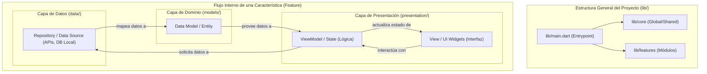
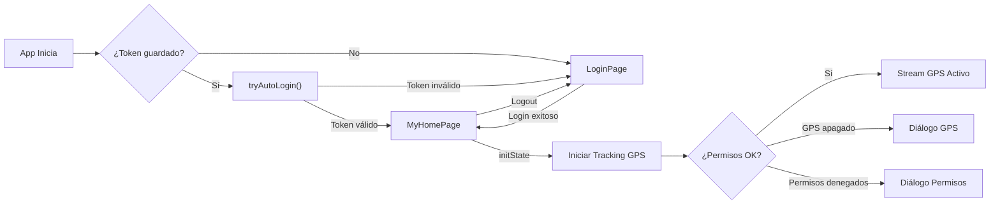

# SPB Móvil Multiplataforma

Aplicación móvil multiplataforma desarrollada en **Flutter** para **Servicios Personalizados del Bajío (SPB)**. Orientada a operadores de campo para la gestión de entregas, rastreo satelital en tiempo real y administración de rutas.

> **Nombre de la app:** SPB Movil  
> **Versión:** 1.0.0+1  
> **SDK mínimo:** Dart ^3.12.2  
> **Arquitectura:** Clean Architecture + MVVM  

---

## Tabla de Contenidos

1. [Descripción General](#descripción-general)
2. [Pantallas de la Aplicación](#pantallas-de-la-aplicación)
   - [Pantalla de Login (Inicio de Sesión)](#1-pantalla-de-login-inicio-de-sesión)
   - [Pantalla Principal (Panel Administrativo)](#2-pantalla-principal-panel-administrativo)
   - [Diálogo de GPS Desactivado](#3-diálogo-de-gps-desactivado)
   - [Diálogo de Permisos Bloqueados](#4-diálogo-de-permisos-bloqueados)
3. [Módulos Planeados (En Desarrollo)](#módulos-planeados-en-desarrollo)
4. [Modelo de Datos](#modelo-de-datos)
5. [Servicios del Sistema](#servicios-del-sistema)
6. [Endpoints de la API](#endpoints-de-la-api)
7. [Permisos de la Aplicación](#permisos-de-la-aplicación)
8. [Arquitectura del Proyecto](#arquitectura-del-proyecto)
9. [Estructura de Directorios](#estructura-de-directorios)
10. [Paleta de Colores y Tema](#paleta-de-colores-y-tema)

---

## Descripción General

SPB Móvil es la aplicación de campo de Servicios Personalizados del Bajío. Permite a los operadores:

- **Iniciar sesión** con sus credenciales de la empresa.
- **Ser rastreados en tiempo real** mientras realizan entregas, reportando coordenadas GPS cada 20 metros al panel administrativo web.
- **Persistir su sesión** mediante tokens almacenados en `SharedPreferences`, evitando iniciar sesión cada vez que abren la app.

La comunicación con el backend se realiza mediante una **API REST en PHP** alojada en `spbservicios.com`.

---

## Pantallas de la Aplicación

### 1. Pantalla de Login (Inicio de Sesión)

**Archivo:** `lib/features/auth/presentation/login_page.dart`  
**Clase:** `LoginPage`  
**Estilo de diseño:** Modern-minimal, tema utilitario  

#### Descripción Visual

Pantalla de fondo blanco (`#FFFFFF`) con un diseño minimalista y limpio. No utiliza imágenes ni logos, centrando la atención en la funcionalidad. Los campos de entrada usan bordes inferiores (underline) en lugar de bordes completos.

#### Elementos de la Interfaz

| Elemento | Descripción |
|---|---|
| **Título principal** | Texto `"Bienvenido"` en 32px, peso w500, color `#0F172A`, con letter-spacing de -0.8 |
| **Subtítulo** | Texto `"SPB - Sistema de Entregas"` en 12px, peso w700, color `#64748B`, con letter-spacing de 1.0 |
| **Campo de usuario** | `TextFormField` con etiqueta `"USUARIO"` (10px, w800, `#64748B`), placeholder `"Nombre de usuario"`, teclado tipo email |
| **Campo de contraseña** | `TextFormField` con etiqueta `"CONTRASEÑA"`, placeholder `"••••••••"`, texto oculto por defecto |
| **Botón de visibilidad** | Icono de ojo (`visibility_off_outlined` / `visibility_outlined`) para mostrar/ocultar la contraseña, color `#64748B`, tamaño 20px |
| **Botón "ENTRAR"** | `ElevatedButton` de ancho completo, altura 48px, color primario `#7A1C2E`, texto blanco 14px w700, bordes redondeados 6px |
| **Indicador de carga** | `CircularProgressIndicator` blanco de 20x20px que reemplaza al texto del botón durante la autenticación |
| **Pie de página** | Texto `"© 2026 • SERVICIOS PERSONALIZADOS DEL BAJÍO"` centrado, 10px, `#64748B` |
| **Enlaces del pie** | Botones de texto `"SOPORTE"` y `"PRIVACIDAD"` separados por un punto (`•`), color `#475569` |

#### Funcionalidades

| Función | Descripción Detallada |
|---|---|
| **Validación de formulario** | Utiliza un `GlobalKey<FormState>` para validar ambos campos antes de enviar. El campo de usuario valida que no esté vacío ni contenga solo espacios. El campo de contraseña valida que no esté vacío. |
| **Inicio de sesión** | Al presionar "ENTRAR", desenfoca el teclado (`FocusScope.unfocus()`), llama a `AuthViewModel.login()` que realiza un `POST` a la API `/login.php` con las credenciales. |
| **Estado de carga** | Mientras se procesa la petición, el botón se deshabilita (opacidad 55%) y muestra un spinner blanco. Se impide múltiples envíos simultáneos. |
| **Mensaje de éxito** | Al autenticarse correctamente, muestra un `SnackBar` flotante con fondo verde (`successColor`) y el texto `"Sesión iniciada correctamente"`. |
| **Manejo de errores** | Si la API rechaza las credenciales o hay un error de red, el `AuthViewModel` emite un `errorMessage` que se muestra como `SnackBar` flotante con fondo rojo (`errorColor`). |
| **Persistencia de token** | Tras un login exitoso, el token JWT se almacena en `SharedPreferences` con la clave `'auth_token'` para restaurar la sesión automáticamente en el próximo uso. |
| **Toggle de contraseña** | El icono de ojo alterna entre `obscureText: true/false` para mostrar u ocultar la contraseña ingresada. |
| **Auto-login** | Al iniciar la app, `_MyAppState._checkSavedSession()` busca un token guardado y llama a `AuthViewModel.tryAutoLogin()` para restaurar la sesión sin pedir credenciales. Si el token es inválido o ha expirado, redirige silenciosamente al login. |

#### Estados del Botón "ENTRAR"

| Estado | Apariencia |
|---|---|
| **Normal** | Fondo `#7A1C2E`, texto blanco `"ENTRAR"` |
| **Carga (Loading)** | Fondo `#7A1C2E` al 55% de opacidad, spinner blanco animado |
| **Deshabilitado** | Se deshabilita (`onPressed: null`) mientras `isLoading` es `true` |

#### Estilos de los Campos de Entrada

| Estado del campo | Color del borde inferior |
|---|---|
| **Normal (enabled)** | `#E2E8F0` |
| **Enfocado (focused)** | `#7A1C2E` (color primario) |
| **Error** | `#D50000` (rojo error) |
| **Error + enfocado** | `#D50000` |
| **Deshabilitado** | `#F1F5F9` |
| **Hover** | Fondo se oscurece ligeramente a `#F8FAFC` |

---

### 2. Pantalla Principal (Panel Administrativo)

**Archivo:** `lib/main.dart`  
**Clase:** `MyHomePage`  
**Título del AppBar:** `"Panel Administrativo SPB"`  

#### Descripción Visual

Pantalla principal que se muestra tras la autenticación exitosa. Presenta la información del usuario en el centro de la pantalla y un indicador animado del estado de rastreo GPS. El AppBar tiene fondo color primario (`#7A1C2E`) con texto blanco.

#### Elementos de la Interfaz

| Elemento | Descripción |
|---|---|
| **AppBar** | Título `"Panel Administrativo SPB"`, fondo `#7A1C2E`, con botón de logout (ícono `Icons.logout`) a la derecha |
| **Avatar del usuario** | Ícono `account_circle` de 80px, color primario `#7A1C2E` |
| **Nombre del usuario** | Texto `"Bienvenido, {nombre}"` en 24px, negrita, color `#1E293B` |
| **Email del usuario** | Texto `"Email: {correo}"` en 16px, color gris `Colors.grey[600]` |
| **Badge de rol** | Contenedor redondeado (16px de radio) con fondo primario al 10% de opacidad, texto del rol en mayúsculas, 12px, negrita, color primario |
| **Card de estado de rastreo** | Contenedor animado (`AnimatedContainer`, 300ms) que cambia de apariencia según el estado del tracking |

#### Card de Estado de Rastreo — Estados

| Estado | Apariencia | Contenido |
|---|---|---|
| **Activo** ✅ | Fondo `green.shade50`, borde `green.shade200` | Ícono `sensors` verde + texto `"Rastreo Automático Activo"` (verde oscuro) + descripción `"Tu ubicación se está reportando automáticamente en segundo plano cada 20 metros."` |
| **Inactivo** ⚠️ | Fondo `orange.shade50`, borde `orange.shade200` | Ícono `sensors_off` naranja + texto `"Rastreo Automático Inactivo"` (naranja oscuro) + descripción + botón `"Activar Rastreo"` (fondo naranja, texto blanco) |

#### Funcionalidades

| Función | Descripción Detallada |
|---|---|
| **Inicio automático de tracking** | Al cargar la pantalla (`initState`), se llama a `_intentarIniciarTracking()` mediante `addPostFrameCallback` para solicitar permisos GPS e iniciar el rastreo en segundo plano automáticamente. |
| **Rastreo GPS en tiempo real** | Utiliza `LocationService.iniciarTrackingAutomatico()` que abre un stream de `Geolocator` configurado para reportar la posición del operador cada **20 metros** de desplazamiento. Cada nueva posición se envía automáticamente mediante `POST` a `/guardar_ubicacion.php`. |
| **Indicador reactivo de tracking** | El `ValueListenableBuilder` escucha `LocationService.trackingActivoNotifier` y actualiza la card de estado en tiempo real con una animación suave de 300ms cuando el tracking se activa o desactiva. |
| **Botón de activar rastreo** | Si el tracking está inactivo, se muestra un botón `"Activar Rastreo"` que vuelve a intentar solicitar permisos e iniciar el stream GPS. |
| **Cerrar sesión (Logout)** | El botón de logout en el AppBar: (1) detiene el rastreo GPS automático (`LocationService.detenerTrackingAutomatico()`), (2) limpia el estado del usuario y elimina el token de `SharedPreferences`, (3) muestra un `SnackBar` flotante con `"Sesión cerrada"`, (4) redirige automáticamente a la pantalla de login. |
| **Limpieza al salir** | En `dispose()`, se detiene el tracking automático para liberar el stream de ubicación y evitar fugas de memoria. |

#### Configuración del Tracking por Plataforma

| Plataforma | Configuración Específica |
|---|---|
| **Android** | `AndroidSettings` — Precisión alta, notificación permanente en la barra: `"SPB Móvil está registrando tu ruta de trabajo en segundo plano."`, intervalo de 15 segundos, filtro de distancia 20m |
| **iOS / macOS** | `AppleSettings` — Precisión alta, tipo de actividad `fitness`, pausa automática habilitada, indicador azul de fondo visible en la barra de estado |
| **Otras plataformas** | `LocationSettings` genérica — Precisión alta, filtro de distancia 20m |

---

### 3. Diálogo de GPS Desactivado

**Origen:** `LocationService.solicitarPermisosUbicacion()`  
**Tipo:** `AlertDialog` modal (no descartable)  

#### Descripción Visual

Diálogo con bordes redondeados (16px) que aparece cuando el servicio de GPS del dispositivo está apagado.

#### Elementos

| Elemento | Descripción |
|---|---|
| **Ícono del título** | `Icons.gps_off`, color naranja, 28px |
| **Título** | `"GPS Desactivado"` |
| **Mensaje** | `"Para registrar tu ruta de trabajo en tiempo real, activa el servicio de ubicación (GPS) de tu dispositivo."` |
| **Botón "Cancelar"** | `TextButton`, texto gris, cierra el diálogo sin acción |
| **Botón "Activar GPS"** | `ElevatedButton`, fondo naranja, texto blanco, abre la pantalla nativa de configuración GPS del dispositivo mediante `Geolocator.openLocationSettings()` |

---

### 4. Diálogo de Permisos Bloqueados

**Origen:** `LocationService._mostrarDialogoAjustes()`  
**Tipo:** `AlertDialog` modal (no descartable)  

#### Descripción Visual

Diálogo con bordes redondeados (16px) que aparece cuando el usuario ha denegado los permisos de ubicación de forma permanente.

#### Elementos

| Elemento | Descripción |
|---|---|
| **Ícono del título** | `Icons.settings`, color rojo (`Colors.redAccent`), 28px |
| **Título** | `"Permisos Bloqueados"` |
| **Mensaje** | `"Has denegado el acceso a la ubicación de forma permanente. Para continuar usando las funciones de tracking, ve a la configuración de la aplicación en tu celular y activa la localización manualmente."` |
| **Botón "Cancelar"** | `TextButton`, texto gris, cierra el diálogo |
| **Botón "Ir a Ajustes"** | `ElevatedButton`, fondo rojo, texto blanco, abre los ajustes de la app del dispositivo mediante `Geolocator.openAppSettings()` |

---

## Módulos Planeados (En Desarrollo)

Los siguientes módulos tienen la estructura de carpetas creada (`data/`, `models/`, `presentation/`) pero aún no contienen implementación:

| Módulo | Directorio | Propósito Esperado |
|---|---|---|
| **Delivery Status** | `lib/features/delivery_status/` | Gestión y visualización del estado de las entregas (pendiente, en camino, entregado, etc.) |
| **Route** | `lib/features/route/` | Visualización y administración de las rutas asignadas al operador |
| **Scanner** | `lib/features/scanner/` | Escaneo de códigos QR/barras para identificar paquetes y confirmar entregas |
| **Tracking** | `lib/features/tracking/` | Pantalla dedicada al rastreo satelital y visualización de la ruta en mapa (complemento al tracking automático ya implementado en `LocationService`) |

---

## Modelo de Datos

### UserModel

**Archivo:** `lib/features/auth/models/user_model.dart`

Estructura inmutable que representa un usuario autenticado del sistema.

| Campo | Tipo | Descripción |
|---|---|---|
| `idUsuario` | `int` | Identificador único del usuario en la base de datos |
| `usuario` | `String` | Nombre de usuario para login |
| `email` | `String` | Correo electrónico del usuario |
| `rol` | `String` | Rol del usuario en el sistema (ej: `"operador"`, `"admin"`) |
| `token` | `String?` | Token JWT para autenticación de peticiones subsecuentes (opcional) |

#### Métodos

| Método | Descripción |
|---|---|
| `UserModel.fromJson(json, {token})` | Crea una instancia desde un `Map<String, dynamic>` de la API. Acepta tanto `id_usuario` como `idUsuario`, y tanto `email` como `correo` como claves del JSON. |
| `toJson()` | Convierte la instancia a un mapa JSON serializable. |
| `copyWith({...})` | Crea una copia del modelo con campos modificados de forma inmutable. |

---

## Servicios del Sistema

### LocationService

**Archivo:** `lib/core/services/location_service.dart`  
**Tipo:** Servicio estático (todos los métodos son `static`)  

Servicio global responsable del rastreo GPS en tiempo real. Opera completamente en segundo plano.

| Método | Tipo | Descripción |
|---|---|---|
| `solicitarPermisosUbicacion(context)` | `Future<bool>` | Solicita permisos GPS al usuario. Verifica: (1) si el GPS está habilitado, (2) si la app tiene permisos. Maneja todos los estados posibles mostrando diálogos nativos o personalizados. |
| `iniciarTrackingAutomatico(context, idUsuario, {token})` | `Future<void>` | Inicia un stream de posiciones GPS. Configura la escucha según la plataforma (Android con foreground service, iOS con indicador de fondo). Cada nueva posición se envía automáticamente a la API. |
| `detenerTrackingAutomatico()` | `Future<void>` | Cancela la suscripción al stream GPS y actualiza `trackingActivoNotifier` a `false`. |
| `obtenerUbicacionActual()` | `Future<Position?>` | Obtiene una única lectura de la posición actual con precisión alta y timeout de 15 segundos. |
| `enviarUbicacion(idUsuario, position, {token})` | `Future<bool>` | Envía un `POST` a la API con: `id_usuario`, `latitud`, `longitud`, `accuracy` y `timestamp` en formato ISO 8601 UTC. |

| Propiedad | Tipo | Descripción |
|---|---|---|
| `trackingActivoNotifier` | `ValueNotifier<bool>` | Notificador reactivo que la UI utiliza para mostrar el estado actual del tracking (activo/inactivo). |

### AuthViewModel

**Archivo:** `lib/features/auth/presentation/auth_view_model.dart`  
**Tipo:** `ChangeNotifier` (patrón MVVM)  

| Método | Tipo | Descripción |
|---|---|---|
| `login(usuario, pass)` | `Future<bool>` | Autentica al usuario contra la API y almacena el token en `SharedPreferences`. |
| `tryAutoLogin(token)` | `Future<bool>` | Restaura la sesión usando un token guardado previamente, obteniendo el perfil del usuario. |
| `logout()` | `void` | Limpia el estado, elimina el token de `SharedPreferences` y notifica a los listeners. |

| Propiedad | Tipo | Descripción |
|---|---|---|
| `currentUser` | `UserModel?` | El usuario autenticado actual, o `null` si no hay sesión. |
| `isLoading` | `bool` | Indica si hay una operación de autenticación en curso. |
| `errorMessage` | `String?` | Mensaje de error de la última operación fallida. |
| `isAuthenticated` | `bool` | `true` si `currentUser` no es nulo. |

---

## Endpoints de la API

**Base URL de producción:** `https://spbservicios.com/spb/api`  
**Base URL local (emulador Android):** `http://10.0.2.2/SPB/api`

| Endpoint | Método HTTP | URI | Descripción |
|---|---|---|---|
| **Login** | `POST` | `/login.php` | Autentica al usuario con `{ usuario, pass }`. Retorna `{ success, token, data }`. |
| **Perfil (Me)** | `GET` | `/me.php` | Obtiene los datos del usuario autenticado. Requiere header `Authorization: Bearer {token}`. |
| **Guardar Ubicación** | `POST` | `/guardar_ubicacion.php` | Registra las coordenadas GPS del operador con `{ id_usuario, latitud, longitud, accuracy, timestamp }`. |

### Estructura de Respuesta Exitosa

```json
{
  "success": true,
  "token": "jwt_token_string",
  "data": {
    "id_usuario": 1,
    "usuario": "operador1",
    "email": "operador@spb.com",
    "rol": "operador"
  }
}
```

### Estructura de Respuesta de Error

```json
{
  "success": false,
  "message": "Credenciales incorrectas"
}
```

---

## Permisos de la Aplicación

### Android (`AndroidManifest.xml`)

| Permiso | Propósito |
|---|---|
| `ACCESS_FINE_LOCATION` | Obtener ubicación precisa mediante GPS |
| `ACCESS_COARSE_LOCATION` | Obtener ubicación aproximada como fallback |
| `ACCESS_BACKGROUND_LOCATION` | Continuar obteniendo ubicación con la app minimizada |
| `FOREGROUND_SERVICE` | Ejecutar el servicio de rastreo como servicio en primer plano con notificación persistente |
| `FOREGROUND_SERVICE_LOCATION` | Especifica que el servicio en primer plano accede a la ubicación |

---

## Arquitectura del Proyecto

El proyecto adopta **Clean Architecture** combinada con **MVVM** (Model-View-ViewModel):



### Flujo de Navegación



---

## Estructura de Directorios

```text
lib/
├── core/                  # Componentes compartidos y utilidades globales
│   ├── constants/         # Constantes del sistema (vacío — en desarrollo)
│   ├── network/           # Configuración de red
│   │   └── api_config.dart    # URLs base y URIs de los endpoints
│   ├── services/          # Servicios globales
│   │   └── location_service.dart  # Rastreo GPS y envío de coordenadas
│   └── theme/             # Sistema de diseño visual
│       ├── app_colors.dart    # Paleta de colores de la aplicación
│       └── app_theme.dart     # ThemeData de Material 3
├── features/              # Módulos independientes de la app
│   ├── auth/              # ✅ Módulo de Autenticación (implementado)
│   │   ├── data/
│   │   │   └── app_repository.dart    # Peticiones HTTP a login y perfil
│   │   ├── models/
│   │   │   └── user_model.dart        # Modelo inmutable del usuario
│   │   └── presentation/
│   │       ├── auth_view_model.dart    # ViewModel con ChangeNotifier
│   │       └── login_page.dart        # Pantalla de inicio de sesión
│   ├── delivery_status/   # 🔲 Módulo de Estado de Entregas (pendiente)
│   │   ├── data/
│   │   ├── models/
│   │   └── presentation/
│   ├── route/             # 🔲 Módulo de Rutas (pendiente)
│   │   ├── data/
│   │   ├── models/
│   │   └── presentation/
│   ├── scanner/           # 🔲 Módulo de Escaneo QR/Barras (pendiente)
│   │   ├── data/
│   │   ├── models/
│   │   └── presentation/
│   └── tracking/          # 🔲 Módulo de Rastreo en Mapa (pendiente)
│       ├── data/
│       ├── models/
│       └── presentation/
└── main.dart              # Punto de entrada + Pantalla Principal (MyHomePage)
```

---

## Paleta de Colores y Tema

### Colores Principales (`AppColors`)

| Nombre | Hex | Uso |
|---|---|---|
| `primary` | `#7A1C2E` | Color principal de la marca (guinda/burdeos) — botones, AppBar, acentos |
| `secondary` | `#FBEAEC` | Color secundario claro — fondos suaves |
| `accentColor` | `#A30036` | Color de acento — elementos destacados |
| `backgroundColor` | `#FFFFFF` | Fondo general de la aplicación |
| `successColor` | `#00C853` | SnackBars y estados de éxito |
| `errorColor` | `#D50000` | SnackBars y bordes de error |
| `warningColor` | `#FFA500` | Alertas de advertencia |
| `infoColor` | `#2196F3` | Información general |

### Tema Material 3 (`AppTheme`)

- **Material 3** habilitado (`useMaterial3: true`)
- **AppBar:** Fondo primario `#7A1C2E` con texto blanco
- **Botones elevados:** Fondo `#7A1C2E`, texto blanco, deshabilitado `#6C757D`
- **ColorScheme:** Basado en `ColorScheme.light()` con la paleta personalizada

---

## Dependencias

| Paquete | Versión | Propósito |
|---|---|---|
| `http` | ^1.6.0 | Peticiones HTTP a la API REST |
| `geolocator` | ^12.0.0 | Rastreo GPS, permisos de ubicación y servicios en segundo plano |
| `shared_preferences` | ^2.3.2 | Almacenamiento local persistente para tokens de sesión |
| `cupertino_icons` | ^1.0.8 | Iconos estilo iOS |

---

## Comenzando

### Prerrequisitos

- Flutter SDK ^3.12.2
- Dart SDK ^3.12.2
- Android Studio / VS Code con extensiones Flutter

### Instalación

```bash
# Clonar el repositorio
git clone <url-del-repositorio>

# Instalar dependencias
flutter pub get

# Ejecutar en modo debug
flutter run
```

### Configuración de Entorno

En `lib/core/network/api_config.dart`, cambiar `useLocal` según el entorno:

```dart
// true = API local (desarrollo con emulador)
// false = API de producción (spbservicios.com)
static const bool useLocal = false;
```