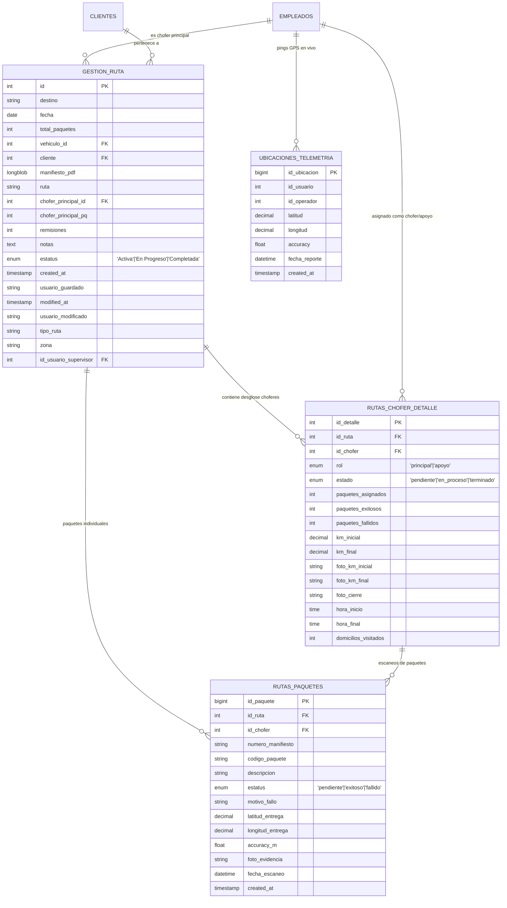
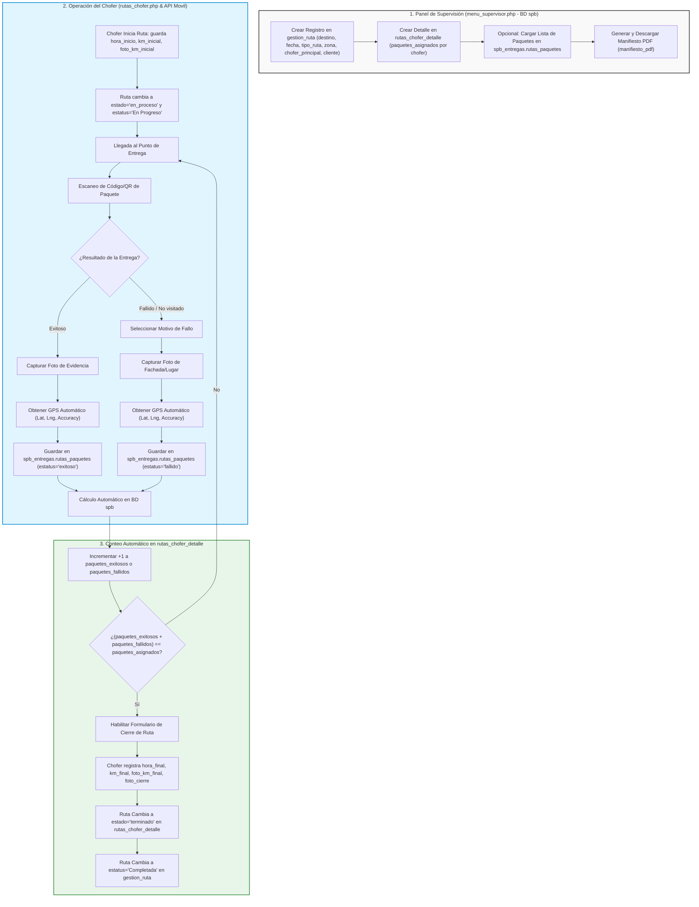

# Diagrama de Arquitectura y Flujo de Entregas

Este documento ilustra la arquitectura exacta de las tablas de la base de datos `spb` (`gestion_ruta`, `rutas_chofer_detalle`) y la extensión de `spb_entregas` (`rutas_paquetes`, `ubicaciones`).

> 📌 **Ver también:** [Diagrama de Flujo Módulo Uno por Uno](file:///c:/xampp/htdocs/SPB/docs/diagrama_flujo_uno_por_uno.md) para el detalle del flujo del operador en campo, escaneo de guía física y captura de evidencia.

---

## 1. Diagrama de Arquitectura de Datos (Campos Exactos de `spb` vs `spb_entregas`)

---

## 2. Diagrama de Flujo Operativo Integrado

---

## 3. Resumen de Campos de `gestion_ruta` Integrados

| Campo en `gestion_ruta` | Tipo | Descripción |
| :--- | :--- | :--- |
| `id` | `int (PK)` | ID único autoincrementable de la ruta |
| `destino` | `varchar(255)` | Destino (ej: "LEON", "GDL", "MTY") |
| `fecha` | `date` | Fecha programada de la ruta (`YYYY-MM-DD`) |
| `total_paquetes` | `int` | Total general de paquetes en la ruta |
| `vehiculo_id` | `int (FK)` | ID del vehículo asignado en `empleados_vehiculo` |
| `cliente` | `int (FK)` | ID del cliente en `clientes` |
| `manifiesto_pdf` | `longblob` | Archivo o datos del manifiesto en PDF |
| `ruta` | `varchar(500)` | Nombre o folio de la ruta (ej: "01", "02") |
| `chofer_principal_id` | `int (FK)` | ID del chofer titular en `empleados` |
| `chofer_principal_pq` | `int` | Paquetes asignados al chofer principal |
| `remisiones` | `int` | Número o cantidad de remisiones |
| `notas` | `text` | Observaciones adicionales de la ruta |
| `estatus` | `enum` | `'Activa'`, `'En Progreso'`, `'Completada'` |
| `tipo_ruta` | `varchar(45)` | `'Local'`, `'Foránea'` |
| `zona` | `varchar(500)` | Zona o sector delimitado |
| `id_usuario_supervisor` | `int (FK)` | ID del supervisor que creó la ruta |

---

## 4. Resumen de Campos de `rutas_chofer_detalle` Integrados

| Campo en `rutas_chofer_detalle` | Tipo | Descripción |
| :--- | :--- | :--- |
| `id_detalle` | `int (PK)` | ID único del detalle de asignación por chofer |
| `id_ruta` | `int (FK)` | Clave foránea referenciando `gestion_ruta.id` (`CASCADE DELETE`) |
| `id_chofer` | `int (FK)` | ID del chofer/operador o apoyo en `empleados` |
| `rol` | `enum` | `'principal'` (titular de la ruta) o `'apoyo'` (apoyo asignado) |
| `estado` | `enum` | `'pendiente'`, `'en_proceso'`, `'terminado'` |
| `paquetes_asignados` | `int` | Paquetes asignados individualmente a este chofer (`mis_paquetes`) |
| `paquetes_exitosos` | `int` | Conteo en tiempo real de entregas exitosas |
| `paquetes_fallidos` | `int` | Conteo en tiempo real de entregas fallidas |
| `km_inicial` | `decimal(10,2)` | Kilometraje al iniciar la ruta |
| `km_final` | `decimal(10,2)` | Kilometraje al finalizar la ruta |
| `foto_km_inicial` | `varchar(255)` | Ruta del archivo de foto KM inicial |
| `foto_km_final` | `varchar(255)` | Ruta del archivo de foto KM final |
| `foto_cierre` | `varchar(255)` | Ruta del archivo de foto de evidencia de cierre |
| `hora_inicio` | `time` | Hora de inicio de ruta |
| `hora_final` | `time` | Hora de finalización de ruta |
| `domicilios_visitados` | `int` | Cantidad de domicilios visitados en entregas fallidas |
