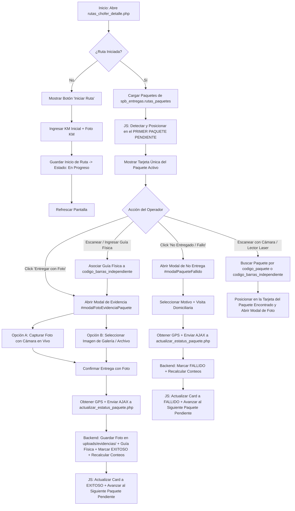

# Plan de Arquitectura y Flujo de Trabajo: Módulo de Entregas "Uno por Uno" con Guía Física y Evidencia

## Resumen del Objetivo
Implementar una interfaz móvil fluida ("Uno por Uno") donde el operador entregue sus paquetes correlativamente. El sistema maneja dos códigos para cada paquete:
1. **`codigo_paquete`**: Código autogenerado del sistema (ej: `PK-R258-C29-004`).
2. **`codigo_barras_independiente`**: Código de barras físico o número de guía impreso en la caja (ej: `asdasd`, `27363ni234`).

Antes de marcar cada paquete como **Entregado**, el sistema permite vincular/escanear su **guía física** (`codigo_barras_independiente`), captura la **foto de evidencia** + **coordenadas GPS** y actualiza el registro en la base de datos, avanzando al siguiente paquete pendiente.

---

## Diagrama de Flujo del Sistema (Mermaid)

---

## Estructura de Datos en Base de Datos (`spb_entregas.rutas_paquetes`)

| Campo | Tipo | Descripción |
| :--- | :--- | :--- |
| `id_paquete` | `INT` | ID primario del paquete |
| `id_ruta` | `INT` | ID de la ruta (`gestion_ruta.id`) |
| `id_chofer` | `INT` | ID del operador asignado (`empleados.id`) |
| `numero_manifiesto` | `VARCHAR` | Número de manifiesto/ruta |
| `codigo_paquete` | `VARCHAR` | Código único del sistema (ej: `PK-R258-C29-004`) |
| **`codigo_barras_independiente`** | `VARCHAR` | Guía física escaneada/ingresada (ej: `asdasd`) |
| `estatus` | `ENUM` | `pendiente`, `exitoso`, `fallido` |
| `foto_evidencia` | `VARCHAR` | Ruta de la foto en `uploads/evidencias/` |
| `latitud_entrega` | `DECIMAL` | Latitud GPS al entregar |
| `longitud_entrega` | `DECIMAL` | Longitud GPS al entregar |
| `accuracy_m` | `DECIMAL` | Precisión en metros de la lectura GPS |

---

## Pasos de Aplicación en Código
1. **Lectura y Visualización en Tarjetas:**
   - Mostrar `codigo_paquete` en grande.
   - Mostrar campo o badge interactivo para `codigo_barras_independiente` (Guía Física escaneada).
2. **Asociación en AJAX (`marcarPaqueteExitoso`):**
   - Enviar `codigo_escaneado` junto a la foto de evidencia Base64 y GPS para guardarse en la columna `codigo_barras_independiente`.
3. **Control Anti-Bloqueos (Navegación e Interfaz):**
   - Definir `regresarSeguro()` y limpieza de `modal-backdrop` para que ningún cuadro transparente bloquee la pantalla o botones.
