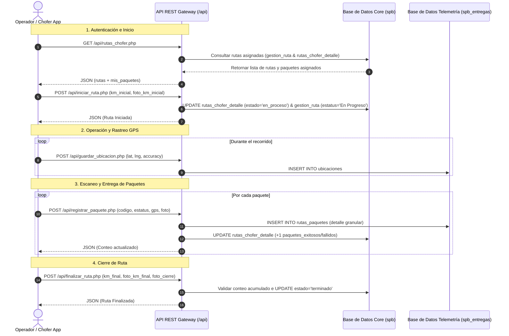

# Manual Técnico e Integración de la API Móvil de Operadores (SPB)

Este manual documenta el flujo de integración completo de las APIs REST para aplicaciones móviles Android/iOS y clientes web de operadores en el sistema SPB.

---

## 1. Arquitectura General y Flujo de Operación

La solución se compone de 4 etapas principales en la jornada del operador:



---

## 2. Catálogo de Endpoints de la API

| Endpoint | Método | Módulo | Descripción |
| :--- | :--- | :--- | :--- |
| `/api/login.php` | `POST` | Auth | Autenticación y obtención de token |
| `/api/me.php` | `GET` | Auth | Información del usuario autenticado y su operador asignado |
| `/api/rutas_chofer.php` | `GET` | Rutas | Lista de rutas asignadas al operador o catálogo global |
| `/api/iniciar_ruta.php` | `POST` | Rutas | Registro de inicio de ruta, kilometraje inicial y foto |
| `/api/registrar_paquete.php` | `POST` | Paquetes | Registro de escaneo de paquete (exitoso o fallido) |
| `/api/obtener_paquetes.php` | `GET` | Paquetes | Consulta de paquetes registrados en una ruta |
| `/api/finalizar_ruta.php` | `POST` | Rutas | Cierre de ruta, kilometraje final y evidencias fotográficas |
| `/api/guardar_ubicacion.php` | `POST` | Ubicaciones | Ping de geolocalización GPS en vivo |
| `/api/operadores_ubicacion.php` | `GET` | Ubicaciones | Consulta de última ubicación reportada por operador |

---

## 3. Autenticación y Cabeceras

Todas las peticiones a las APIs aceptan las siguientes modalidades de autenticación:

1. **Header Authorization Bearer**:
   ```http
   Authorization: Bearer <TOKEN_DE_SESION>
   ```
2. **Header Token**:
   ```http
   Token: <TOKEN_DE_SESION>
   ```
3. **Parámetro explícito**: `?id_operador=27` o `id_operador` en el cuerpo JSON/FormData.

---

## 4. Especificación Detallada de Endpoints

### 4.1 Iniciar Ruta (`POST /api/iniciar_ruta.php` o `/api/operadores/estado_ruta.php`)
Permite al operador registrar la lectura de kilometraje inicial del vehículo y su foto de evidencia.

- **Content-Type**: `multipart/form-data` o `application/json`
- **Body Params**:
  - `id_ruta` / `ruta_id` (int, obligatorio)
  - `km_inicial` / `kilometraje` (float, obligatorio, > 0) (Soporta Formato V1 `km_inicial` y V2 `kilometraje`)
  - `foto_km_inicial` / `foto_odometro` (archivo, Data URI base64 o RAW base64, obligatorio) (Soporta Formato V1 `foto_km_inicial` y V2 `foto_odometro`)

#### Ejemplo cURL:
```bash
curl -X POST "https://spbservicios.com/spb/api/iniciar_ruta.php" \
     -H "Authorization: Bearer <TOKEN>" \
     -F "id_ruta=236" \
     -F "kilometraje=45200.5" \
     -F "foto_odometro=@odometro_inicio.jpg"
```

---

### 4.2 Registrar Paquete (`POST /api/registrar_paquete.php`)
Registra cada entrega en la base de datos de telemetría `spb_entregas` y suma automáticamente los contadores en la BD principal.

- **Content-Type**: `multipart/form-data` o `application/json`
- **Body Params**:
  - `id_ruta` (int, obligatorio)
  - `codigo_paquete` (string, obligatorio)
  - `estatus` (`exitoso` | `fallido`, obligatorio)
  - `motivo_fallo` (string, obligatorio si `estatus` == `fallido`)
  - `latitud` (float, opcional)
  - `longitud` (float, opcional)
  - `accuracy` (float, opcional)
  - `foto_evidencia` (archivo o string base64, opcional)

#### Ejemplo JavaScript (Fetch con JSON & Base64):
```javascript
const response = await fetch('https://spbservicios.com/spb/api/registrar_paquete.php', {
  method: 'POST',
  headers: {
    'Content-Type': 'application/json',
    'Authorization': `Bearer ${token}`
  },
  body: JSON.stringify({
    id_ruta: 236,
    codigo_paquete: 'PK-2026-9876',
    estatus: 'exitoso',
    latitud: 21.123456,
    longitud: -101.654321,
    accuracy: 4.2,
    foto_evidencia: 'data:image/jpeg;base64,...'
  })
});
const result = await response.json();
```

---

### 4.3 Finalizar Ruta (`POST /api/finalizar_ruta.php`)
Realiza las validaciones de cierre: verifica que los paquetes procesados sean iguales a los paquetes asignados y que el kilometraje final sea superior al inicial.

- **Content-Type**: `multipart/form-data` o `application/json`
- **Body Params**:
  - `id_ruta` (int, obligatorio)
  - `km_final` (float, obligatorio, > `km_inicial`)
  - `domicilios_visitados` (int, obligatorio si hay fallidos)
  - `foto_km_final` (archivo o base64, obligatorio)
  - `foto_cierre` (archivo o base64, obligatorio)

#### Ejemplo Flutter (Dart):
```dart
var request = http.MultipartRequest(
  'POST', 
  Uri.parse('https://spbservicios.com/spb/api/finalizar_ruta.php')
);
request.headers['Authorization'] = 'Bearer $token';
request.fields['id_ruta'] = '236';
request.fields['km_final'] = '45380.0';
request.fields['domicilios_visitados'] = '1';
request.files.add(await http.MultipartFile.fromPath('foto_km_final', '/path/to/km_end.jpg'));
request.files.add(await http.MultipartFile.fromPath('foto_cierre', '/path/to/cierre.jpg'));

var response = await request.send();
```

---

### 4.4 Consultar Paquetes (`GET /api/obtener_paquetes.php`)
Permite visualizar la lista de paquetes escaneados y registrados en una ruta.

- **Query Params**: `id_ruta` (int, obligatorio), `id_operador` (int, opcional).

```bash
curl -X GET "https://spbservicios.com/spb/api/obtener_paquetes.php?id_ruta=236" \
     -H "Authorization: Bearer <TOKEN>"
```

---

## 5. Respuestas de Error Estandarizadas

Todas las APIs del sistema retornan respuestas JSON con estructura homogénea:

#### Éxito (`200 OK`):
```json
{
  "success": true,
  "data": { ... }
}
```

#### Error de Cliente (`400 Bad Request` / `401 Unauthorized`):
```json
{
  "success": false,
  "message": "La foto del kilometraje final es requerida."
}
```

#### Error de Servidor (`500 Internal Server Error`):
```json
{
  "success": false,
  "message": "Error al conectar con la base de datos: [Detalle]"
}
```
