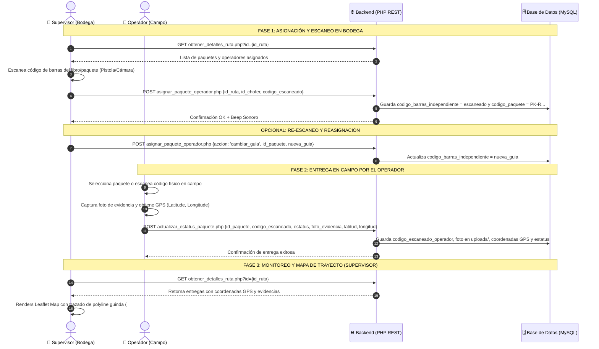

# 📱 Manual de Implementación y Arquitectura Móvil - SPB Entregas

Este documento especifica la **arquitectura técnica completa**, el **flujo de datos**, las **APIs HTTP (Endpoints)** y el **esquema de base de datos** del Sistema de Entregas y Escaneo de Paquetes. Diseñado para ser replicado e integrado en aplicaciones móviles (Android / iOS con Flutter, React Native, Kotlin, Swift o PWA).

---

## 1. 🔄 Flujo General del Proceso de Entregas



---

## 2. 🗄️ Esquema de Base de Datos (`spb_entregas.rutas_paquetes`)

La tabla principal en la base de datos `spb_entregas` almacena la relación entre la ruta, el operador, la guía escaneada por bodega, la guía leída por el operador y la evidencia GPS:

```sql
CREATE TABLE IF NOT EXISTS spb_entregas.rutas_paquetes (
    id_paquete INT(11) NOT NULL AUTO_INCREMENT,
    id_ruta INT(11) NOT NULL,
    id_chofer INT(11) NOT NULL,
    numero_manifiesto VARCHAR(100) DEFAULT NULL,
    codigo_paquete VARCHAR(100) NOT NULL COMMENT 'Código estándar interno ej: PK-R263-C29-002',
    codigo_barras_independiente VARCHAR(100) DEFAULT NULL COMMENT 'Guía física escaneada por el supervisor en bodega',
    codigo_escaneado_operador VARCHAR(100) DEFAULT NULL COMMENT 'Guía física escaneada por el operador en campo',
    estatus ENUM('pendiente', 'exitoso', 'fallido') NOT NULL DEFAULT 'pendiente',
    foto_evidencia VARCHAR(255) DEFAULT NULL COMMENT 'Ruta de la imagen de evidencia (uploads/evidencias/...)',
    motivo_fallo TEXT DEFAULT NULL,
    latitud_entrega DECIMAL(10, 8) DEFAULT NULL COMMENT 'Coordenada GPS Latitud',
    longitud_entrega DECIMAL(11, 8) DEFAULT NULL COMMENT 'Coordenada GPS Longitud',
    accuracy_m DECIMAL(6, 2) DEFAULT NULL COMMENT 'Precisión del sensor GPS en metros',
    fecha_escaneo DATETIME DEFAULT NULL COMMENT 'Fecha y hora exacta de la entrega',
    created_at DATETIME DEFAULT CURRENT_TIMESTAMP,
    updated_at DATETIME DEFAULT CURRENT_TIMESTAMP ON UPDATE CURRENT_TIMESTAMP,
    PRIMARY KEY (id_paquete),
    KEY idx_ruta_chofer (id_ruta, id_chofer),
    KEY idx_codigo_paquete (codigo_paquete),
    KEY idx_codigo_barras (codigo_barras_independiente),
    KEY idx_escaneado_operador (codigo_escaneado_operador)
) ENGINE=InnoDB DEFAULT CHARSET=utf8mb4 COLLATE=utf8mb4_unicode_ci;
```

---

## 3. 🔌 Especificación de APIs y Endpoints HTTP

### 3.1 Endpoint 1: Obtener Detalles y Paquetes de Ruta
* **URL:** `GET database/obtener_detalles_ruta.php?id={id_ruta}`
* **Parámetros GET:**
  * `id` (int): ID único de la ruta.
* **Respuesta JSON:**
```json
{
  "success": true,
  "ruta": {
    "id": 261,
    "ruta": "234423",
    "destino": "LEON",
    "chofer_id": 29,
    "chofer": "MARCO POLO MACIAS",
    "apoyos_ids": [116],
    "apoyos": ["FRANCISCO GUTIÉRREZ"],
    "paquetes_entregas": [
      {
        "id_paquete": 76,
        "id_chofer": 29,
        "codigo_paquete": "PK-R261-C29-001",
        "codigo_barras_independiente": "9786079250614",
        "codigo_escaneado_operador": "9786079250614",
        "estatus": "exitoso",
        "foto_evidencia": "uploads/evidencias/evid_paq_76_1787094663.jpg",
        "latitud_entrega": 21.12190400,
        "longitud_entrega": -101.68253100,
        "accuracy_m": 12.50,
        "fecha_escaneo": "2026-08-18 21:51:00"
      }
    ]
  }
}
```

---

### 3.2 Endpoint 2: Asignar o Vincular Paquete en Bodega
* **URL:** `POST database/asignar_paquete_operador.php`
* **Headers:** `Content-Type: application/json`
* **Body Escaneo:**
```json
{
  "id_ruta": 261,
  "id_chofer": 29,
  "codigo_escaneado": "9786079250614"
}
```
* **Body Re-escanear / Cambiar Guía:**
```json
{
  "accion": "cambiar_guia",
  "id_ruta": 261,
  "id_paquete": 76,
  "nueva_guia": "9786079250999"
}
```

---

### 3.3 Endpoint 3: Registrar Entrega en Campo (Operador)
* **URL:** `POST database/actualizar_estatus_paquete.php`
* **Headers:** `Content-Type: application/json`
* **Body Entrega Exitosa:**
```json
{
  "id_paquete": 76,
  "codigo_escaneado": "9786079250614",
  "estatus": "exitoso",
  "foto_evidencia": "data:image/jpeg;base64,/9j/4AAQSkZJRg...",
  "latitud": 21.121904,
  "longitud": -101.682531,
  "precision": 10.5
}
```
* **Body Entrega Fallida:**
```json
{
  "id_paquete": 76,
  "codigo_escaneado": "9786079250614",
  "estatus": "fallido",
  "motivo_fallo": "Domicilio cerrado / Cliente ausente",
  "foto_evidencia": "data:image/jpeg;base64,/9j/4AAQSkZJRg...",
  "latitud": 21.121904,
  "longitud": -101.682531
}
```

---

## 4. 📲 Guía de UI/UX para la Aplicación Móvil Nativa

Al desarrollar o actualizar la app móvil del operador y bodega:

### 📱 1. Pantalla de Asignación en Bodega (Supervisor)
* **Modo Pantalla Completa:** En móviles, la vista de asignación debe ocupar el 100% de la pantalla (`100vw` x `100vh`).
* **Input de Escaneo Destacado:** Caja de texto con borde de alto contraste (`#198754`) y altura mínima de `48px` - `52px` para facilitar toques táctiles.
* **Escáner Continuo:** Integrar lector de cámara en vivo (ej: `mobile_scanner` en Flutter o `camera` en React Native) con bip de sonido (`beep.mp3`) tras cada captura.

### 🚚 2. Pantalla de Entrega del Operador
* **Búsqueda por Bucle de Guía:** La app debe permitir al operador escanear el código de barras en campo independientemente del orden en que estén ordenados los paquetes en la tabla.
* **Verificación de Coincidencia:**
  * Si `codigo_escaneado_operador` == `codigo_barras_independiente` -> Mostrar Badge Verde `[ ✓ 9786079250614 ]`.
  * Si difieren -> Mostrar Badge Amarillo `[ ⚠️ 9786079250614 ]`.
* **Sensor GPS Integrado:** Solicitar permisos de localización de alta precisión (`enableHighAccuracy: true`) y adjuntar `latitud`, `longitud` y `accuracy_m` en el payload de la entrega.
* **Fotos de Evidencia:** Comprimir la imagen capturada por la cámara del celular a una resolución máxima de **1280x720 JPEG** con calidad `0.7` antes de enviar Base64 a la API para asegurar transferencias ultra rápidas en redes móviles 4G/5G.

### 🗺️ 3. Visualización de Trayecto y Mapa
* Utilizar Leaflet o Google Maps nativo con la secuencia de entregas (`fecha_escaneo ASC`).
* Dibujar polilíneas con guinda corporativo (`#7A1C2E`) marcando pines numerados (`#1`, `#2`, `#3`) para auditar la ruta en tiempo real.
